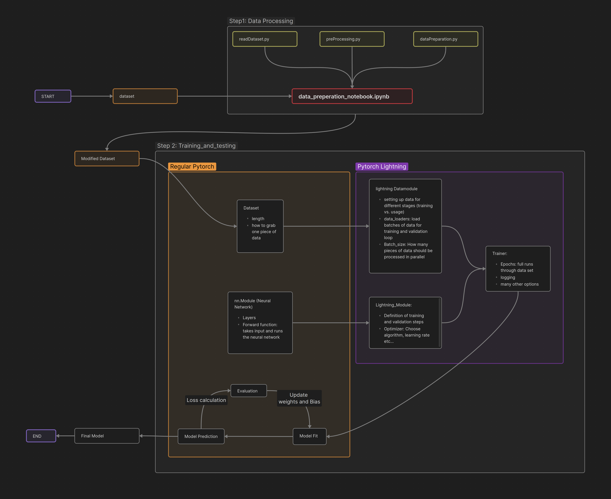

# Motion Prediction Models from inD Dataset

This repository contains code for developing motion prediction models using the inD dataset. The code structure and instructions are outlined below.

## Folder Structure

The entire folder structure is as follows:

### `code`
- **`data_preprocessing`** - [preprocessing code files]
  - **`dataset`** - [put your dataset files here]
  - **`modified_dataset`** - [save your modified dataset files here in a suitable format. E.g. "pickle"]
  - **`data_preperation_notebook.ipynb`** - [main code file for step 1]
  - **`readDataset.py`**
  - **`preProcessing.py`**
  - **`dataPreparation.py`**
- **`training_and_testing`** [check pytorch-lightning documentation for more details]
  - **`callbacks.py`**
  - **`lit_datamodule.py`**
  - **`lit_dataset.py`**
  - **`lit_module.py`**
  - **`main.py`** [main code file for step 2, that uses all files in this folder]
  - **`nn_modules.py`** [contains all the prediction models. You have to add more models here]
  - **`utils.py`** [contains all the utility functions you might need here and there]
- **`results_and_evaluation`** - [save final results and evaluation files here]

## Getting Started

1. Download the `code.zip` file from OLAT.
2. Extract the `code.zip` file to a location of your choice.
3. Place your dataset files in the `dataset` folder.
4. Open the `data_preperation_notebook.ipynb` file and run it.
   - The `data_preperation_notebook.ipynb` file should call the necessary functions in the required order.
5. Open the `main.py` file and run it.
   - The `main.py` file should call the necessary functions in the required order.

## Requirements

Before running the code, make sure you have the required libraries installed. You can install them by running the following command in your terminal:

> pip install -r requirements.txt

Make sure you have the latest version of Python installed.

## Code Structure Diagram

The code structure diagram provides an overview of the relationships between different components of the code.
